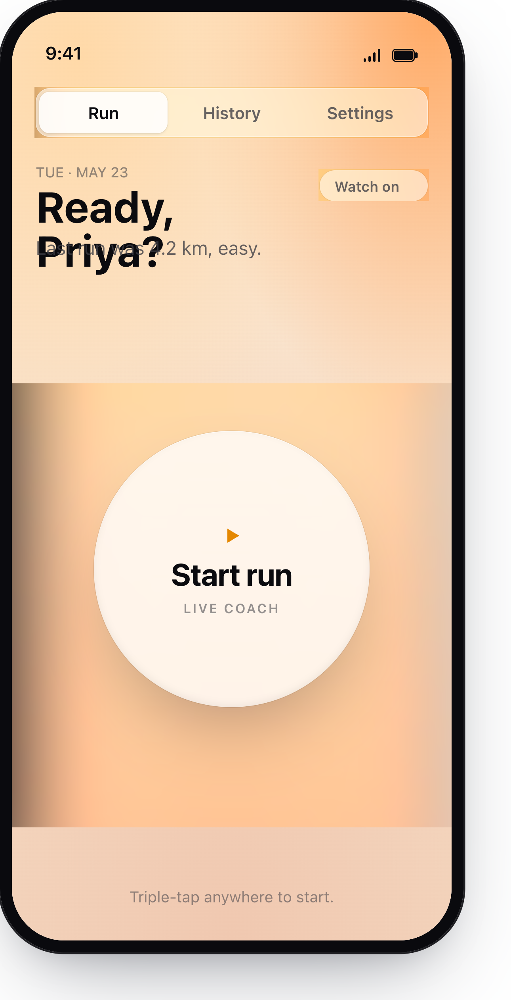
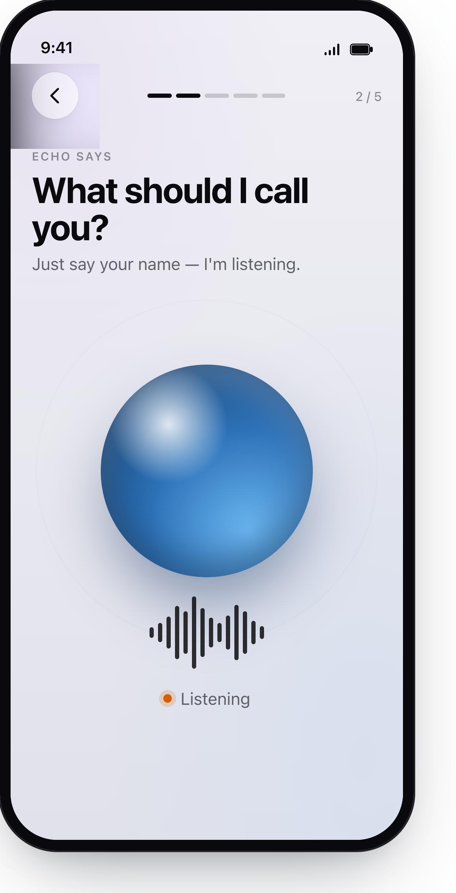

# Momento — On-Device Running Coach (Portfolio)

An iOS + Apple Watch app that coaches you through runs in real time using an
on-device Gemma 4 LLM, Apple Watch sensors, and streaming TTS. This repo
contains the **front-end + design** work for the project.

> Backend / model-serving code is intentionally omitted. Everything here is the
> client (SwiftUI, Combine, HealthKit, WatchConnectivity) plus the original
> design handoff and discarded UI concepts.

---

## What's inside

| Path | Description |
| --- | --- |
| [`ios-app/GemmaCoach/`](ios-app/GemmaCoach) | iPhone app — SwiftUI "Liquid Glass" UI, auth, run session, history, settings, on-device LLM wrapper |
| [`ios-app/GemmaCoachWatch/`](ios-app/GemmaCoachWatch) | Apple Watch companion — HKWorkoutSession sensor producer + WatchConnectivity transport |
| [`ios-app/project.yml`](ios-app/project.yml) | XcodeGen project spec (regenerates the `.xcodeproj`) |
| [`ios-app/Secrets.example.swift`](ios-app/Secrets.example.swift) | Template for the local, git-ignored secrets file |
| [`design_handoff_momento/`](design_handoff_momento) | The original design handoff — React/CSS mockups, wireframes, metric spec, screen specs |
| [`trashed-ui-concepts/`](trashed-ui-concepts) | Three scrapped early concept directions (kept for reference) |
| [`screenshots/`](screenshots) | Six current-build screenshots of the iOS app |

---

## Screenshots

| Sign in | Run | History |
| :---: | :---: | :---: |
|  |  |  |

| Run breakdown | Settings | Onboarding (listening) |
| :---: | :---: | :---: |
|  |  |  |

---

## Architecture (front-end)

**iPhone (`GemmaCoach`)**

- **UI** — SwiftUI with a custom "Liquid Glass" design system (`Momento/MomentoTheme.swift`, `Momento/GlassComponents.swift`)
- **Auth** — Supabase + Sign in with Apple + Google Sign-In (`Services/AuthManager.swift`, `Services/SupabaseManager.swift`)
- **On-device LLM** — Gemma 4 E2B via `CoreML-LLM` (`EngineModel.swift`, `GemmaDownloader.swift`)
- **Coaching loop** — drain-then-fire pacing; speech length self-paces the loop (`LiveSession.swift`)
- **TTS** — Cartesia streaming voice (`Services/CartesiaTTS.swift`) with `AVSpeechSynthesizer` fallback (`CoachSpeaker.swift`)
- **Sensors / mirror** — WatchConnectivity receiver + HealthKit fallback (`RunMetricsManager.swift`)
- **Storage** — SwiftData `RunRecord` model (`Models/RunRecord.swift`)

**Apple Watch (`GemmaCoachWatch`)**

- `HKWorkoutSession` + `HKLiveWorkoutBuilder` for HR, distance, energy, running power/stride/cadence, vertical oscillation, ground contact
- `CMPedometer` for live cadence (HealthKit doesn't expose it during workouts)
- `WCSession.sendMessage` @ 1 Hz to the phone, `transferUserInfo` fallback when unreachable

**Voice + perception**

- Voice onboarding & in-run voice input (`Services/VoiceInputController.swift`)
- Camera-based hazard detection scaffolding in `Perception/` (YOLOv11n CoreML — `Models/yolo11n.mlpackage`)

---

## Build

Requires Xcode 26, iOS 26 SDK, watchOS 26 SDK, and a paid Apple Developer account
(the entitlements include HealthKit + Sign in with Apple).

```bash
brew install xcodegen
cd ios-app

# Copy the secrets template and fill in the values (Supabase URL/anon key,
# Google iOS + Web client IDs, Cartesia TTS key).
cp Secrets.example.swift GemmaCoach/Services/Secrets.swift
$EDITOR GemmaCoach/Services/Secrets.swift

xcodegen generate
open GemmaCoach.xcodeproj
```

Bundle IDs: `com.sujalshrestha.momento` (iPhone), `com.sujalshrestha.momento.watchkitapp` (Watch).

---

## Design

[`design_handoff_momento/`](design_handoff_momento) is the original handoff used
to build the current UI — React mockups, the "Apple" vs "Glass" style sheets,
wireframes, and the metric / screen specs. The SwiftUI implementation in
`ios-app/GemmaCoach/` is a 1:1 recreation of those screens.

[`trashed-ui-concepts/`](trashed-ui-concepts) holds three earlier directions
that were explored and rejected before settling on the Liquid Glass look.
